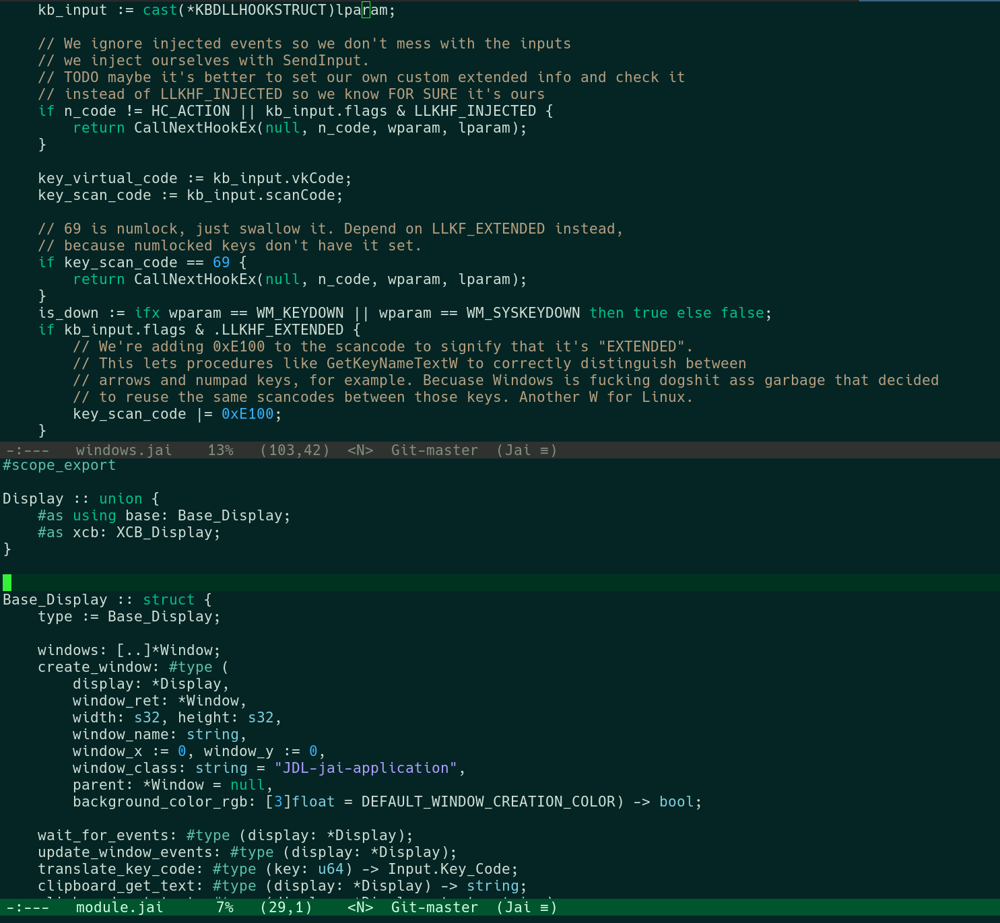

# jai-mode.el

This is a minimalistic major-mode for Jai, systems level programming language developed by Jonathan Blow. It does not rely on treesitter. For treesitter-based mode, see [jai-ts-mode](https://github.com/cpoile/jai-ts-mode)



# Install

You can just copy `jai-mode.el` and then
```elisp
(load "/path/to/jai-mode.el")
```

You can also install it with various Emacs package managers.
Here's fancy example for [Elpaca](https://github.com/progfolio/elpaca): with use-package integration and some useful customizations

```elisp
;; Requires project.el, which ships with Emacs since v28 (circa beginning 2022)
(defun my/project-root-or-default-dir ()
  (if-let ((proj (project-current)))
      (project-root proj)
    default-directory))

(defun setup-jai-mode ()
  (setq js-indent-level 4
        indent-tabs-mode nil)
  ;; This sets compile-command for compilation-mode - useful when you're compiling from Emacs.
  ;; jai-mode supports clicking on compile error messages to navigate directly to the source.
  (setq-local compile-command
              (concat "jai "
                      (let* ((root (my/project-root-or-default-dir))
                             (build-jai (concat root "build.jai"))
                             (main-jai (concat root "main.jai"))
                             (current-jai (buffer-file-name)))
                        (cond
                         ((file-exists-p build-jai) build-jai)
                         ((file-exists-p main-jai) main-jai)
                         (t current-jai))))))

(use-package jai-mode
  :defer t
  :ensure (jai-mode :host github :repo "valignatev/jai-mode")
  :config
  :hook ((jai-mode-hook . setup-jai-mode)))
```

# Features

- syntax highlighting (duh)
- error regexps for integration in compilation-mode
- highlight herestring `#string` as code if the tag is `CODE`, e.g.

```jai
code :: #string CODE
// code here
CODE
```

- automatic indentation
- imenu support


# License

Public domain (see LICENSE file)
